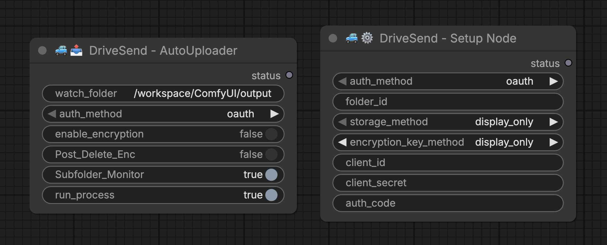

# ComfyUI DriveSend Node (ComfyUI >> Google Drive)

Automatically upload your ComfyUI output files to Google Drive with optional encryption. Set it and forget it!

> **Prefer Dropbox?** Check out [DropSend Node](https://github.com/machinepainting/ComfyUI_DropSendNode)



---

## 🔄 How It Works

```
┌─────────────────────────────────────────────────────────────────────────────┐
│                         CLOUD (RunPod, etc.)                                │
│                                                                             │
│      ComfyUI generates files ──→ DriveSend Node ──→ Uploads to Google Drive │
│        (png, mp4, etc.)         │                                           │
│                                 │                                           │
│                                 ▼                                           │
│                      ┌──────────────────────┐                               │
│                      │ Encryption OPTIONAL  │                               │
│                      │ ☐ OFF: file.png      │                               │
│                      │ ☑ ON:  file.png.enc  │                               │
│                      └──────────────────────┘                               │
└─────────────────────────────────────────────────────────────────────────────┘
                                    │
                                    ▼
                             ☁️ GOOGLE DRIVE
                                    │
                                    ▼
┌─────────────────────────────────────────────────────────────────────────────┐
│                           YOUR LOCAL MACHINE                                │
│                                                                             │
│   Google Drive syncs/downloads ──→ If encrypted: Run decrypt script (local) │
│                                                 ──→ file.png (viewable!)    │
│                                                                             │
│                                 If not encrypted: Ready to use!             │
└─────────────────────────────────────────────────────────────────────────────┘
```

**Encryption is completely optional.** Leave `enable_encryption` off and files upload directly as-is.

---

## 📤 Features

### DriveSend AutoUploader Node
- Real-time folder monitoring with optional subfolder support
- Supports: `.png`, `.jpg`, `.jpeg`, `.webp`, `.gif`, `.mp4`, `.avi`, `.mov`
- Optional AES-128 encryption before upload
- SHA256 checksum verification
- Queue system for reliable uploads

### DriveSend Setup Node
- OAuth 2.0 authentication for personal Gmail (free)
- Outputs credentials for RunPod environment variables
- Optional encryption key generation

### Decryption Scripts (Local Use)
- Cross-platform scripts for macOS, Windows, and Linux
- Decrypt `.enc` files after downloading from Google Drive

---

## 💾 Installation

```bash
cd ComfyUI/custom_nodes/
git clone https://github.com/machinepainting/ComfyUI_DriveSendNode.git
pip install -r ComfyUI_DriveSendNode/requirements.txt
```

Restart ComfyUI after installation.

---

## 🔧 Google Cloud Setup

### Step 1: Create Google Cloud Project

1. Go to [Google Cloud Console](https://console.cloud.google.com/)
2. Sign in with your **personal Gmail account**
3. Click **Select a project** (next to "Google Cloud" logo) → **New Project**
4. Name it (e.g., `ComfyUI-DriveSend`) → Click **Create**
5. Make sure your new project is selected

### Step 2: Enable Google Drive API

1. Go to **APIs & Services** → **Library** (left sidebar)
2. Search for **Google Drive API**
3. Click on it → Click **Enable**

### Step 3: Configure Google Auth Platform

1. Go to **APIs & Services** → **OAuth consent screen** (left sidebar)
2. Click **Get Started**
3. Fill in:
   - **App name:** `DriveSend`
   - **User support email:** Select your email
4. Click **Next** → Select **External** → Click **Next**
5. Enter your email for contact information → Click **Next**
6. Check the agreement box → Click **Create**

### Step 4: Create OAuth Client

1. Click **Create OAuth Client**
2. **Application type:** Select **Desktop app**
3. **Name:** `DriveSend`
4. Click **Create**

⚠️ **IMPORTANT:** Copy and save these values NOW:
- **Client ID** (ends with `.apps.googleusercontent.com`)
- **Client Secret** (starts with `GOCSPX-`)
- Click **Download JSON** as backup

5. Click **Done**

### Step 5: Create a Google Drive Folder

1. Go to [Google Drive](https://drive.google.com/)
2. Create a new folder (e.g., `ComfyUI_Uploads`)
3. Open the folder and copy the **Folder ID** from the URL:
   ```
   https://drive.google.com/drive/folders/XXXXXXXXXXXXXXXXX
                                          └── This is your Folder ID
   ```

---

## 🏃‍♂️ DriveSend Setup (RunPod & Cloud Users)

### Step 6: Run Setup Node

1. Add **DriveSend Setup Node** to your ComfyUI workflow
2. Configure:
   - `auth_method`: **oauth**
   - `folder_id`: Paste your Folder ID
   - `client_id`: Paste your Client ID
   - `client_secret`: Paste your Client Secret
   - `auth_code`: Leave blank (for now)
   - `storage_method`: **display_only**
   - `encryption_key_method`: **Display Only** (or **off** if not using encryption)

3. Run the node → Check the terminal for a URL
4. **Copy and open the URL** to open Google authorization
5. Sign in and **accept access** for DriveSend
6. Click **Continue** when prompted → Copy the **authorization code**
7. Paste code into `auth_code` field
8. Run the node again

### Step 7: Copy Credentials from Console

The console displays:

```
============================================================
[DriveSend Setup] Configuration Complete!
============================================================

GOOGLE_DRIVE_FOLDER_ID=your_folder_id
GOOGLE_CLIENT_ID=your_client_id.apps.googleusercontent.com
GOOGLE_CLIENT_SECRET=GOCSPX-your_secret
GOOGLE_REFRESH_TOKEN=your_refresh_token
COMFYUI_ENCRYPTION_KEY=your_key (if encryption enabled)

============================================================
```

**Copy only the value after the `=` sign** (do not include the "VARIABLE_NAME=").

### Step 8: Create RunPod Secrets

1. Go to [RunPod.io](https://www.runpod.io) → Click **Secrets** in sidebar
2. Create these secrets (Make sure the name of the secret is EXACTLY as shown below):

| Secret Name | Secret Value |
|-------------|--------------|
| `GOOGLE_DRIVE_FOLDER_ID` | Your folder ID |
| `GOOGLE_CLIENT_ID` | Your client ID |
| `GOOGLE_CLIENT_SECRET` | Your client secret |
| `GOOGLE_REFRESH_TOKEN` | Your refresh token |
| `COMFYUI_ENCRYPTION_KEY` | Your encryption key *(optional - only if using encryption)* |

### Step 9: Create a Custom Template (Recommended)

Creating a template saves your environment variables so you don't have to add them every time.

1. Go to [RunPod.io](https://www.runpod.io) → Click **My Templates** in sidebar
2. Click **+ New Template**
3. Configure your template settings (container image, GPU, etc.)
4. Click **Environment Variables** dropdown
5. Click **+ Add Environment Variable** for each:

| Key | Value (click 🗝️ and select secret) |
|-----|-------------------------------------|
| `GOOGLE_DRIVE_FOLDER_ID` | `{{ RUNPOD_SECRET_GOOGLE_DRIVE_FOLDER_ID }}` |
| `GOOGLE_CLIENT_ID` | `{{ RUNPOD_SECRET_GOOGLE_CLIENT_ID }}` |
| `GOOGLE_CLIENT_SECRET` | `{{ RUNPOD_SECRET_GOOGLE_CLIENT_SECRET }}` |
| `GOOGLE_REFRESH_TOKEN` | `{{ RUNPOD_SECRET_GOOGLE_REFRESH_TOKEN }}` |
| `COMFYUI_ENCRYPTION_KEY` | `{{ RUNPOD_SECRET_COMFYUI_ENCRYPTION_KEY }}` *(optional)* |

6. Click **Save Template**
7. When deploying a new pod, click **Change Template** → select your custom template. Done!

> ⚠️ **Why this matters:** If you skip creating a custom template, you'll have to manually add all 5 environment variables every single time you start a new pod. Save yourself the headache — make the template once and reuse it.

> **💡 New to templates?** Take a template you already use, copy its container/docker settings into a new custom template, add the environment variables above, and save. That's it.

> **Already have a pod running?** Terminate it → deploy a new pod using your custom template. This is the cleanest way to pick up the new environment variables.

### Step 10: Test Upload

1. Open ComfyUI on your RunPod
2. Add **DriveSend AutoUploader** node to a workflow
3. Set:
   - `auth_method`: **oauth**
   - `run_process`: **True**
   - `enable_encryption`: **True** or **False** (your choice)
   - `Post_Delete_Enc`: **False**
   - `Subfolder_Monitor`: **True**
   - `Run_Process`: **True**
4. Run a workflow that generates an image
5. Check your Google Drive folder!

---

## 💻 DriveSend Setup (Local Users)

1. Add **DriveSend Setup Node** to your workflow
2. Configure:
   - `auth_method`: **oauth**
   - `folder_id`: Paste your Folder ID
   - `client_id`: Paste your Client ID
   - `client_secret`: Paste your Client Secret
   - `auth_code`: Leave blank (for now)
   - `storage_method`: **env_file**
   - `encryption_key_method`: **save to .env** (or off)

3. Run the node → Click URL in terminal → Authorize → Copy auth code
4. Paste code into `auth_code` field → Run again
5. Restart ComfyUI to load the `.env` file
6. Add **DriveSend AutoUploader Node** and run!

---

## 🔐 Decryption Scripts (Local Use Only)

The `/scripts/` folder contains scripts to decrypt `.enc` files on your local machine.

> ⚠️ **LOCAL USE ONLY** — Run these after downloading encrypted files from Google Drive.

> **ONLY DECRYPT ONCE FILES HAVE BEEN MOVED TO YOUR LOCAL COMPUTER OR EXTERNAL HD. OTHERWISE IT DEFEATS THE PURPOSE OF ENCRYPTION BEFORE SENDING .enc TO CLOUD STORAGE.**

### Prerequisites on local machine for decrypting

```bash
pip install cryptography
```

### Store Your Encryption Key

**macOS (Keychain):**
1. Open Keychain Access → File → New Password Item
2. Name: `ComfyUI_Encryption_Key`, Account: `ComfyUI`, Password: your key

**Windows (Environment Variable):**
1. Win + R → `sysdm.cpl` → Advanced → Environment Variables
2. New User Variable: `COMFYUI_ENCRYPTION_KEY` = your key

**Linux (Environment Variable):**
```bash
echo 'export COMFYUI_ENCRYPTION_KEY="your_key_here"' >> ~/.bashrc
source ~/.bashrc
```

### Run Decryption

### Local Decryption (Decrypt Files on Your Computer)

Once your encrypted `.enc` files have been downloaded from the cloud, you can decrypt them locally using the platform-specific scripts provided in this repo.

#### Step-by-Step

1. **Go to the [`/scripts`](https://github.com/machinepainting/ComfyUI_DriveSendNode/tree/main/scripts) folder** in this repository.

2. **Select the script for your platform:**

   | Platform | Script |
   |---|---|
   | macOS | `decrypt_folder_mac.sh` |
   | Windows | `decrypt_folder_win.py` |
   | Linux | `decrypt_folder_linux.sh` |
   | Cross-platform | `decrypt_folder.py` |

3. **Download the script** and place it in a convenient location on your computer. Your user root/home directory is recommended for easy terminal access (e.g. `~/` on macOS/Linux or `C:\Users\YourName\` on Windows).

4. **Open a terminal** and navigate to the folder where you saved the script:
   ```bash
   # macOS / Linux — example if saved to home directory
   cd ~/

   # Windows (Command Prompt) — example if saved to user folder
   cd C:\Users\YourName\
   ```

5. **Run the decryption script:**
   ```bash
   # macOS
   ./decrypt_folder_mac.sh

   # Windows
   python decrypt_folder_win.py

   # Linux
   ./decrypt_folder_linux.sh

   # Cross-platform (Python)
   python decrypt_folder.py
   ```

6. **When prompted, drag in (or paste the path to) the folder containing your `.enc` files.**

7. **The script will decrypt your files.** Once complete, you'll be asked if you'd like to move the original `.enc` files to a separate folder for cleanup. Note: the script will **never delete your files** — you can remove the `.enc` originals manually at your own discretion.

That's it — your decrypted files are now available locally on your machine, off the cloud and ready to use.

---

## 🛠️ Troubleshooting

### "storageQuotaExceeded" Error
- **Cause:** Using service account with personal Gmail
- **Fix:** Use OAuth (the instructions above). Service accounts only work with Google Workspace.

### "invalid_grant" Error
- **Cause:** Auth code expired or already used
- **Fix:** Clear the `auth_code` field, run setup again, get new auth code

### OAuth Credentials Not Found
- **Cause:** Environment variables not set
- **Fix:** Check RunPod Secrets AND Environment Variables in pod template

### "Access blocked: App not verified"
- **Cause:** OAuth consent screen not configured
- **Fix:** Complete Step 3 (Configure Google Auth Platform)

### Encryption Key Not Found
- **Cause:** Environment variable not set
- **Fix:** Verify secret name is exactly `COMFYUI_ENCRYPTION_KEY`, restart pod

### Files Not Uploading
- Check console for error messages
- Verify Folder ID is correct
- Confirm `run_process` is **True**

---

## ⚠️ Security Best Practices

1. **Never commit your `.env` file** — Add to `.gitignore`
2. **Backup your encryption key** — Without it, encrypted files cannot be recovered
3. **Use secure key storage** — Prefer Keychain/Environment Variables over plain text

---

## 🧪 Tested On

- Python 3.10 / 3.11
- ComfyUI (Feb 2026)
- RunPod GPU instances
- Google Drive API v3

---

## 📁 Repository Structure

```
ComfyUI_DriveSendNode/
├── __init__.py
├── drivesend_uploader_node.py
├── drivesend_setup_node.py
├── gdrive_upload.py
├── gdrive_auth_manager.py
├── encrypt_file.py
├── monitor_output.py
├── requirements.txt
├── README.md
├── .gitignore
└── scripts/
    ├── decrypt_folder.py
    ├── decrypt_folder_mac.sh
    ├── encrypt_folder_mac.sh
    ├── decrypt_folder_win.py
    ├── encrypt_folder_win.py
    ├── decrypt_folder_linux.sh
    └── encrypt_folder_linux.sh
```

---

## 🏢 Google Workspace Users (Service Account Method)

> **Note:** This method is for paid Google Workspace accounts only. Personal Gmail users should use OAuth (instructions above).

Service accounts have **0 GB storage quota** on personal Gmail and will fail with "storageQuotaExceeded" error. They only work with Google Workspace Shared Drives.

If you have a Google Workspace account and want to use a service account:

1. Create a service account in Google Cloud Console
2. Download the JSON key file
3. Create a Shared Drive and add the service account as Content Manager
4. Base64 encode the JSON and add as `GOOGLE_SERVICE_ACCOUNT_JSON` secret
5. Set `auth_method` to **service_account** in the nodes

For detailed instructions, see the [Google Workspace documentation](https://cloud.google.com/iam/docs/service-accounts).

---

## License

MIT
