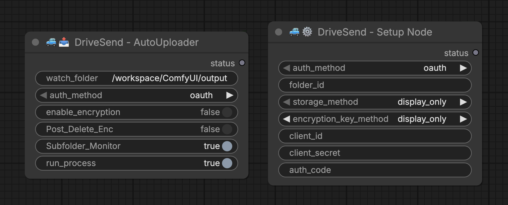

# ComfyUI DriveSend Node (ComfyUI to Google Drive)

Automatically upload your ComfyUI output files to Google Drive with optional encryption. Set it and forget it.

> **Prefer Dropbox?** Check out [DropSend Node](https://github.com/machinepainting/ComfyUI_DropSendNode)



---

## How It Works

```
┌─────────────────────────────────────────────────────────────────────────────┐
│                         CLOUD (RunPod, etc.)                                │
│                                                                             │
│      ComfyUI generates files ──→ DriveSend Node ──→ Uploads to Google Drive │
│        (png, mp4, etc.)         │                                           │
│                                 │                                           │
│                                 ▼                                           │
│                      ┌──────────────────────┐                               │
│                      │ Encryption OPTIONAL  │                               │
│                      │ ☐ OFF: file.png      │                               │
│                      │ ☑ ON:  file.png.enc  │                               │
│                      └──────────────────────┘                               │
└─────────────────────────────────────────────────────────────────────────────┘
                                    │
                                    ▼
                             ☁️ GOOGLE DRIVE
                                    │
                                    ▼
┌─────────────────────────────────────────────────────────────────────────────┐
│                           YOUR LOCAL MACHINE                                │
│                                                                             │
│   Google Drive syncs/downloads ──→ If encrypted: Run decrypt script (local) │
│                                                 ──→ file.png (viewable!)    │
│                                                                             │
│                                 If not encrypted: Ready to use!             │
└─────────────────────────────────────────────────────────────────────────────┘
```

Encryption is optional. Leave `enable_encryption` off and files upload as-is.

---

## Two Nodes

### DriveSend Setup Node
Runs once. Exchanges your Google OAuth credentials for a refresh token, then either writes them to `.env` (local installs) or shows them in a one-shot browser panel (cloud installs) so you can copy them into your platform's secrets manager. Also supports Google Workspace service accounts.

### DriveSend AutoUploader Node
Runs every workflow. Watches your ComfyUI output folder, optionally encrypts each new file, and uploads it to Google Drive. Supports `.png`, `.jpg`, `.jpeg`, `.webp`, `.gif`, `.mp4`, `.avi`, `.mov`. Includes SHA256 verification, queue-based retries, and optional subfolder monitoring.

---

## Installation

```bash
cd ComfyUI/custom_nodes/
git clone https://github.com/machinepainting/ComfyUI_DriveSendNode.git
pip install -r ComfyUI_DriveSendNode/requirements.txt
```

Restart ComfyUI after installation.

---

## Step 1: Set Up Your Google Cloud Project

This part takes about 5 minutes the first time and never again.

### A) Create the project

1. Go to [Google Cloud Console](https://console.cloud.google.com/) and sign in with your Gmail.
2. Click **Select a project** (next to "Google Cloud") then **New Project**.
3. Name it (e.g. `ComfyUI-DriveSend`) and click **Create**.
4. Make sure the new project is selected.

### B) Enable the Google Drive API

1. Open **APIs & Services** then **Library** (left sidebar).
2. Search for **Google Drive API** and click **Enable**.

### C) Configure the OAuth consent screen

1. Open **APIs & Services** then **OAuth consent screen**.
2. Click **Get Started**.
3. Fill in:
   - **App name:** `DriveSend`
   - **User support email:** your email
4. Click **Next**, choose **External**, click **Next**.
5. Enter your email for contact info, click **Next**.
6. Check the agreement box and click **Create**.

### D) Create the OAuth client

1. Click **Create OAuth Client**.
2. **Application type:** **Desktop app**.
3. **Name:** `DriveSend`.
4. Click **Create**.
5. Copy and save these two values now:
   - **Client ID** (ends with `.apps.googleusercontent.com`)
   - **Client Secret** (starts with `GOCSPX-`)
6. Click **Done**.

### E) Create a Drive folder and grab its ID

1. Go to [Google Drive](https://drive.google.com/) and create a folder (e.g. `ComfyUI_Uploads`).
2. Open the folder and copy the ID from the URL:

```
https://drive.google.com/drive/folders/XXXXXXXXXXXXXXXXX
                                       ^^^^^^^^^^^^^^^^^
                                       this is the folder_id
```

---

## Step 2: Run the Setup Node

The Setup Node is gated behind an environment variable. This prevents a remote workflow from hijacking or wiping your credentials. Pick the section that matches where you run ComfyUI.

### A) Cloud (RunPod and similar)

**1. Set the gate.** Add this to your RunPod template's **Environment Variables**:

```
COMFYUI_DRIVESEND_ALLOW_SETUP=1
```

Start (or restart) the pod. To verify, open a pod shell and run:

```bash
echo $COMFYUI_DRIVESEND_ALLOW_SETUP    # should print: 1
```

**2. Add the Setup Node to your workflow.** Configure:

| Field | Value |
|---|---|
| `auth_method` | `oauth` |
| `folder_id` | Your Drive folder ID (from Step 1E) |
| `storage_method` | `display_only` (values shown in browser, never saved on the pod) |
| `encryption_key_method` | `display_only` (or `off` if you do not want encryption) |
| `reconnect` | leave off |

**3. Click "Set credentials..."** on the node. A modal opens with three password fields:

| Field | What to paste |
|---|---|
| Google OAuth Client ID | Your Client ID (from Step 1D) |
| Google OAuth Client Secret | Your Client Secret (from Step 1D) |
| Auth Code | Leave blank for now |

Click **Save**. The modal closes.

**4. Click Queue (Run).** The node prints an OAuth URL. The URL is delivered three ways, use whichever works:

- A browser popup opens automatically (preferred)
- The ComfyUI terminal prints a `DRIVESEND - GOOGLE DRIVE AUTHORIZATION REQUIRED` banner with the URL (Cmd or Ctrl click to open)
- Wire a `Show Text` node to the Setup Node's `STRING` output

**5. Authorize at Google.** Sign in, click Allow, and copy the authorization code Google displays.

**6. Paste the auth code.** A second modal auto-opens for this. Paste your Client ID, Client Secret, and the new Auth Code. Click **Save**.

**7. Click Queue again.** A **DriveSend Credentials** panel appears in your browser with these values:

| Value | Description |
|---|---|
| `GOOGLE_DRIVE_FOLDER_ID` | Your Drive folder ID |
| `GOOGLE_CLIENT_ID` | From Google Cloud Console |
| `GOOGLE_CLIENT_SECRET` | From Google Cloud Console |
| `GOOGLE_REFRESH_TOKEN` | Long-lived token, just generated |
| `COMFYUI_ENCRYPTION_KEY` | Only if you chose to generate one |

Each value has a **Copy** button. There is also a **Copy all as NAME=value** button.

The panel is browser-only. Closing it discards the data and nothing is saved on the pod. If you close it before copying, just rerun the Setup Node to regenerate the values.

**8. Save the values to RunPod Secrets.** In RunPod, click **Secrets** and create a secret for each value. Names must match exactly:

| Secret Name | Value |
|---|---|
| `GOOGLE_DRIVE_FOLDER_ID` | from the panel |
| `GOOGLE_CLIENT_ID` | from the panel |
| `GOOGLE_CLIENT_SECRET` | from the panel |
| `GOOGLE_REFRESH_TOKEN` | from the panel |
| `COMFYUI_ENCRYPTION_KEY` | from the panel (only if using encryption) |

**9. Add the secrets to your pod template.** Click **My Templates**, edit your template, and under **Environment Variables** add:

| Key | Value |
|---|---|
| `GOOGLE_DRIVE_FOLDER_ID` | `{{ RUNPOD_SECRET_GOOGLE_DRIVE_FOLDER_ID }}` |
| `GOOGLE_CLIENT_ID` | `{{ RUNPOD_SECRET_GOOGLE_CLIENT_ID }}` |
| `GOOGLE_CLIENT_SECRET` | `{{ RUNPOD_SECRET_GOOGLE_CLIENT_SECRET }}` |
| `GOOGLE_REFRESH_TOKEN` | `{{ RUNPOD_SECRET_GOOGLE_REFRESH_TOKEN }}` |
| `COMFYUI_ENCRYPTION_KEY` | `{{ RUNPOD_SECRET_COMFYUI_ENCRYPTION_KEY }}` (optional) |

Save the template. The next time you deploy a pod from this template, ComfyUI will see the credentials automatically.

> You can now remove `COMFYUI_DRIVESEND_ALLOW_SETUP=1` from the template unless you plan to re-run the Setup Node from this pod.

**10. Deploy a fresh pod from your template.** Skip to **Step 3**.

---

### B) Local install

**1. Set the gate in the same shell that will launch ComfyUI:**

```bash
# macOS / Linux
export COMFYUI_DRIVESEND_ALLOW_SETUP=1

# Windows (Command Prompt)
set COMFYUI_DRIVESEND_ALLOW_SETUP=1

# Windows (PowerShell)
$env:COMFYUI_DRIVESEND_ALLOW_SETUP = "1"
```

Verify (each command should print `1`):

```bash
# macOS / Linux
echo $COMFYUI_DRIVESEND_ALLOW_SETUP

# Windows (Command Prompt)
echo %COMFYUI_DRIVESEND_ALLOW_SETUP%

# Windows (PowerShell)
echo $env:COMFYUI_DRIVESEND_ALLOW_SETUP
```

Now launch ComfyUI from that same shell.

**2. Add the Setup Node to your workflow.** Configure:

| Field | Value |
|---|---|
| `auth_method` | `oauth` |
| `folder_id` | Your Drive folder ID |
| `storage_method` | `env_file` (values written to `.env`, mode `0600`, in the plugin directory) |
| `encryption_key_method` | `save_to_env` (or `off`) |
| `reconnect` | leave off |

**3. Click "Set credentials..."** on the node. In the modal:

| Field | What to paste |
|---|---|
| Google OAuth Client ID | Your Client ID |
| Google OAuth Client Secret | Your Client Secret |
| Auth Code | Leave blank |

Click **Save**.

**4. Click Queue.** The node prints an OAuth URL. Open it, authorize at Google, and copy the auth code.

**5. Paste the auth code.** A second modal auto-opens. Paste Client ID, Client Secret, and Auth Code. Click **Save**.

**6. Click Queue again.** Credentials are written to `.env` in the plugin directory and loaded into the running ComfyUI process. No restart needed.

> Once setup is complete, you can drop `COMFYUI_DRIVESEND_ALLOW_SETUP` from your environment. The AutoUploader does not need it.

---

### C) Service Account (Google Workspace only)

If you have a Google Workspace (paid) account, you can use a service account instead of OAuth. Service accounts do not work with personal Gmail.

1. In Google Cloud Console, open **IAM & Admin** then **Service Accounts**.
2. Create a service account, then create a JSON key for it.
3. Share your Drive folder with the service account's email (e.g. `something@project-id.iam.gserviceaccount.com`).
4. Set `auth_method` on the Setup Node to `service_account`.
5. Click **Set credentials...** and paste the entire JSON body of the key file into the **Service Account JSON** textarea.
6. Click Save, then Queue.

The service account JSON is base64-encoded into `GOOGLE_SERVICE_ACCOUNT_JSON` for you to copy into RunPod Secrets (display_only) or write to `.env` (env_file).

---

## Step 3: Use the AutoUploader

1. Add the **DriveSend AutoUploader Node** to your workflow.
2. Configure:

| Field | What it does |
|---|---|
| `watch_folder` | Folder to monitor for new files (defaults to ComfyUI output, see clamp note in Security section) |
| `auth_method` | `oauth` or `service_account` (must match Step 2) |
| `enable_encryption` | If true, encrypts each file with AES (Fernet) before uploading |
| `Post_Delete_Enc` | After upload, delete the local `.enc` file |
| `Subfolder_Monitor` | Recursively watch subfolders |
| `run_process` | Set to `True` to start uploading |

3. Run a workflow that generates an image. The AutoUploader picks it up, optionally encrypts it, uploads it to your Drive folder, and prints status to the ComfyUI console.

---

## Decryption (Local Use Only)

If you uploaded with `enable_encryption=True`, files arrive in Drive as `filename.ext.enc`. Decrypt them on your local machine after downloading.

> **Decrypt files only after they have been moved to your local computer or external drive.** Decrypting on the cloud pod defeats the purpose of encrypting before upload.

### Install the decrypt dependency

```bash
pip install cryptography
```

### Store your encryption key locally

**macOS (Keychain):**
1. Open Keychain Access, choose File then New Password Item.
2. Name: `ComfyUI_Encryption_Key`. Account: `ComfyUI`. Password: your key.

**Windows:**
1. Press `Win + R`, run `sysdm.cpl`, open **Advanced**, click **Environment Variables**.
2. Under **User variables**, click **New**. Name: `COMFYUI_ENCRYPTION_KEY`. Value: your key.

**Linux:**
```bash
echo 'export COMFYUI_ENCRYPTION_KEY="your_key_here"' >> ~/.bashrc
source ~/.bashrc
```

### Run the decrypt script

1. Open the `/scripts/` folder in this repository and pick your platform:

   | Platform | File |
   |---|---|
   | macOS | `mac/decrypt_folder_mac.sh` |
   | Windows | `win/decrypt_folder_win.py` |
   | Linux | `linux/decrypt_folder_linux.sh` |
   | Cross-platform | `decrypt_folder.py` (Python) |

2. Save the script to a convenient location (your home folder works well).

3. Open a terminal in that location and run:

   ```bash
   # macOS
   ./decrypt_folder_mac.sh

   # Linux
   ./decrypt_folder_linux.sh

   # Windows
   python decrypt_folder_win.py

   # Cross-platform Python
   python decrypt_folder.py
   ```

4. When prompted, drag in (or paste the path to) the folder containing your `.enc` files.

5. The script decrypts each file alongside the original. Once finished, you are asked whether to move the `.enc` originals into a separate cleanup folder. Originals are never deleted automatically.

> Each platform folder also contains an encryption script if you ever want to encrypt files manually outside of ComfyUI. The node itself handles encryption automatically during upload.

---

## Troubleshooting

### Files are not uploading
- Set `run_process` to `True`.
- Check the ComfyUI console for upload errors.
- Confirm the Drive folder is shared with your Google account (or service account email if using one).

### "Encryption key not found"
- Confirm the secret name is exactly `COMFYUI_ENCRYPTION_KEY`.
- Verify the env var is set in the pod template (then restart the pod).

### "Setup is disabled" or "Reconnect refused"

The Setup Node prints this when `COMFYUI_DRIVESEND_ALLOW_SETUP=1` is not visible to the running ComfyUI process. Stop ComfyUI, set the variable in the same terminal you launch from, verify it, and start ComfyUI again.

```bash
# macOS / Linux
export COMFYUI_DRIVESEND_ALLOW_SETUP=1
echo $COMFYUI_DRIVESEND_ALLOW_SETUP    # prints: 1
```

```cmd
:: Windows (Command Prompt)
set COMFYUI_DRIVESEND_ALLOW_SETUP=1
echo %COMFYUI_DRIVESEND_ALLOW_SETUP%
```

```powershell
# Windows (PowerShell)
$env:COMFYUI_DRIVESEND_ALLOW_SETUP = "1"
echo $env:COMFYUI_DRIVESEND_ALLOW_SETUP
```

For RunPod or Docker, add the variable to the pod template and restart.

> The variable must be set in the **same shell that launches ComfyUI**. Setting it in one terminal and starting ComfyUI from a different one (or via Pinokio, ComfyUI Desktop, a launcher script, etc.) will not work. Adding it to `~/.bashrc` or `~/.zshrc` and opening a fresh terminal also works.

### "Browser delivery refused"

The Setup Node printed this because your prompt was submitted without a `client_id` (typical for `curl` or SDK submissions that omit it). Submitting that way would broadcast credentials to every connected WebSocket client, so the node refuses. Submit the Setup workflow from the ComfyUI web UI instead, or switch `storage_method` to `env_file` to write to disk.

### Browser panel did not appear after `display_only` setup
- Re-run the Setup Node. Credentials are not stored on the pod in this mode, so the panel is the only retrieval path and it regenerates on each run.
- Check the browser's popup or panel blocker.
- If it still does not appear, switch `storage_method` to `env_file` and `cat` the `.env` file from a shell.

### "Storage quota exceeded" with a service account
Service accounts only work with Google Workspace. If you are using a personal Gmail, switch to OAuth.

### Authorization failed
- Confirm `COMFYUI_DRIVESEND_ALLOW_SETUP=1` is set (see above).
- Re-run the Setup Node with `reconnect=True` to clear stale state, then retry.
- If Google does not show a consent screen, revoke access at https://myaccount.google.com/permissions and re-run.

---

## Security Best Practices

1. **Never commit your `.env` file.** It is already in `.gitignore`.
2. **Back up your encryption key.** Without it, encrypted files cannot be recovered.
3. **Prefer Keychain or environment variables** over plaintext storage of the key.

### Threat model for network-reachable ComfyUI hosts

If your ComfyUI is reachable over the network (RunPod, tunnels, LAN, public web UI), anyone who can submit a workflow can in principle set node inputs. To keep DriveSend safe in that setting, the nodes enforce these protections.

- **`watch_folder` is clamped to the ComfyUI output directory.** The AutoUploader runs a recursive Watchdog observer that uploads everything it sees, so an unrestricted path would be an arbitrary-file-read primitive. By default, `watch_folder` must resolve inside the directory returned by `folder_paths.get_output_directory()`. To monitor an additional location, set `COMFYUI_DRIVESEND_ALLOWED_WATCH_PATHS` on the host (`os.pathsep`-separated absolute paths) before starting ComfyUI. Workflow inputs cannot expand this list.

- **Setup Node secret fields are not workflow inputs.** `google_client_id`, `google_client_secret`, `auth_code`, and the service-account JSON body do not appear in the node's `INPUT_TYPES`. They are entered only via a browser-only modal and POSTed to a same-origin route (`/drivesend/setup/stash`) that is gated on a live WebSocket session. They never enter the workflow JSON, PNG metadata, ComfyUI's localStorage auto-save, copy-pasted nodes, or the unauthenticated `/history` endpoint.

- **The Setup Node refuses to write or clear credentials unless explicitly opted in.** This is what `COMFYUI_DRIVESEND_ALLOW_SETUP=1` enforces. A remote workflow submitter can send JSON to ComfyUI but cannot set environment variables on your machine, so the gate proves a human with host access opted in. The AutoUploader never needs this flag.

- **The stash route is hardened.** Same-origin origin check (rejects cross-origin POSTs), live-session check (the supplied `client_id` must match a connected WebSocket), per-IP rate limit (30 POSTs per 10 seconds), 32 KB body cap, JSON validation, 32-entry capacity with 60-second TTL, lock-protected access, one-shot consumption when `setup()` runs.

- **Credentials never travel through the node's `ui` or `result` channels.** ComfyUI persists both into `PromptServer.history`, served on the unauthenticated `/history` HTTP endpoint. Instead the Setup Node delivers credentials via:
  - **`env_file`** (local installs only): values are written to `.env` in the plugin directory (mode `0600`, race-free open) and the node returns only a non-secret confirmation. The OAuth `token.json` (if used) is also written with mode `0600`.
  - **`display_only`** (cloud or hosted ComfyUI): values are pushed to the originating browser session via a one-shot WebSocket message and rendered in a panel inside the workflow tab. Nothing is written to disk on the pod.

- **WebSocket deliveries are sid-targeted, never broadcast.** ComfyUI's `send_sync(event, data, sid=None)` would broadcast to every connected client when `sid` is `None`. The Setup Node refuses to send credential or refresh notifications without a `client_id` and returns a clear "Browser delivery refused" message. As defense in depth, the originating `client_id` is echoed inside each WebSocket payload and the JS handler verifies it matches `api.clientId` before rendering the credentials panel.

- **Logging stores no secrets.** The plugin's `drivesend.log` records file paths, watcher events, and errors. No tokens, refresh tokens, client secrets, service-account JSON, or encryption keys are written to logs or stdout in plaintext. The post-setup banner uses last-4-character redaction so values are not captured by stdout aggregators.

- **Sensitive files are gitignored.** `.env`, `token.json`, `client_secret.json`, `service_account.json`, encryption-key files, editor backups, and Claude Code session data are all listed in `.gitignore`.

### Additional considerations

- **`COMFYUI_DRIVESEND_ALLOW_SETUP` is process-wide, not per-action.** Once set, every workflow submission in that ComfyUI process is unblocked, including hostile submissions during the setup window. Recommended discipline: set the gate, run Setup once, restart ComfyUI without the gate.

- **The OAuth authorization URL contains your Google `client_id`.** Google treats `client_id` as a public identifier (it appears in every OAuth URL), but the URL string itself ends up in `/history` when the Setup Node returns it during the first run. This reveals which Google project the host is paired with. It does not, on its own, allow access to your data.

- **Plain ComfyUI runs over HTTP.** The browser-only credential delivery in `display_only` mode rides the same WebSocket the rest of ComfyUI uses, in cleartext on the wire. On a network you do not fully trust, terminate ComfyUI behind HTTPS (reverse proxy, tunnel) before relying on this path. The most conservative alternative is to run the Setup Node on a local ComfyUI install and copy the values into your cloud secrets manager directly. Credentials never touch the cloud pod's filesystem or its network.

---

## Tested On

- macOS 13+ (Ventura, Sonoma)
- Python 3.10 / 3.11
- ComfyUI (May 2026)
- RunPod GPU instances

---

## Repository Structure

```
ComfyUI_DriveSendNode/
├── __init__.py
├── drivesend_uploader_node.py
├── drivesend_setup_node.py
├── gdrive_upload.py
├── gdrive_auth_manager.py
├── encrypt_file.py
├── monitor_output.py
├── safe_paths.py
├── decrypt_folder.py
├── requirements.txt
├── README.md
├── .gitignore
├── web/
│   └── drivesend_oauth.js
└── scripts/
    ├── decrypt_folder.py
    ├── mac/
    │   ├── decrypt_folder_mac.sh
    │   └── encrypt_folder_mac.sh
    ├── win/
    │   ├── decrypt_folder_win.py
    │   └── encrypt_folder_win.py
    └── linux/
        ├── decrypt_folder_linux.sh
        └── encrypt_folder_linux.sh
```

---

## License

MIT

---

Shout-out to Adam for his contributions to this node build.
